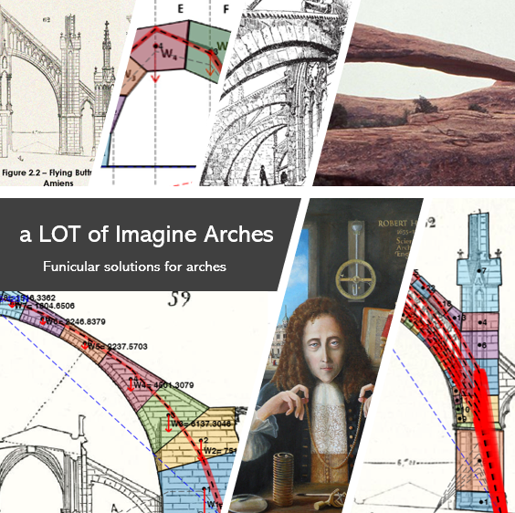

# aLOTofImaginArches

**[Open the application →](https://gcastellazzi.github.io/aLOTofImaginArches/app/)**  ·  **[User guide →](https://gcastellazzi.github.io/aLOTofImaginArches/)**

Interactive graphical statics of masonry arches, in the browser. Load a
photograph of a real arch, trace its intrados and extrados, subdivide the ring
into voussoirs, set a scale, hang loads on it, and then move the line of thrust
through its three degrees of freedom while the software checks, joint by joint,
whether it stays inside the masonry.

An arch stands not because it is in *the* state of equilibrium but because it is
in *one* of infinitely many. That multiplicity — the ∞³ of the classical
literature — is the hardest idea to convey when the subject is taught, and this
software exists so that a student can take hold of it and move it.

Written for the master's courses **MHMS** (Mechanics of Historical Masonry
Structures) and **HMWS** (Historical Masonry and Wooden Structures) at the
University of Bologna.

||
|---|

There is **nothing to install and no licence to buy**: it is a static web page,
plain ES modules with no build step and no dependencies, so the source a student
reads is exactly the source that runs.

||
|---|

## What it does

- **Trace** any image into voussoirs, with the trace checked before it is used —
  too few points, coincident curves, and crossing curves are all reported.
- **Scale and units** — one measured distance turns pixels into metres; SI,
  N–mm and kgf–cm.
- **Loads** placed by clicking, merged into the same sequence as the weights.
- **Three degrees of freedom**: the horizontal thrust, where the line leaves its
  springing joint, and how the total weight divides between the reactions. Both
  ends of the line are free, which is what makes the admissibility criterion
  agree with Heyman's rather than being twice as strict.
- **Admissibility**, joint by joint, with the verdict and the margin left.
- **Mechanism**: the line cannot leave the ring — where it would, it stays
  hooked at the intrados or the extrados and that point becomes a hinge. The
  arch divides into rigid macro-blocks, the degree of freedom is counted, and
  the collapse mechanism is drawn.
- **Poleni's dome**: treat the arch as a lune of a dome rather than a slice of
  a barrel, and the weights follow the width of the lune &mdash; broad at the
  major parallel, closing to nothing at the crown. The line of thrust moves
  with them.
- **Two views** of the right-hand pane: the force polygon, or the voussoirs as
  solids in three dimensions, prismatic or revolved.
- **Both ends imposed**: fix where the line starts and ends, and see the
  classical trial-pole construction that gets it there &mdash; exactly, in one
  correction, not by searching.
- **Whole profiles**: trace closed outlines instead of two faces, and cut them
  into voussoirs radially. A cut through a double shell gives blocks in two
  pieces, weighed as both.
- **Bow's notation**: dashed rays lettered on the force polygon, with the same
  letter on the parallel segment of the thrust line.
- **Hooke's cable**, hung from the two springings themselves.
- **Save and reopen** a whole session as one JSON file.

### A dome is not an arch

The weight of a lune voussoir is exact, by Pappus: *V* = *A*·θ·*r̄*, with *r̄*
the distance of the block's centroid from the axis. On a semicircular ring of
16 equal blocks at a 15° slice:

| share of the total weight | barrel | dome |
|---|---|---|
| a springing block | 6.25 % | 9.75 % |
| the crown block | 6.25 % | 0.96 % |

### The mechanism, in one table

Counting the two springings as hinges throughout, *h* hinges carry *h* − 1
rigid bodies:

| interior hinges | hinges *h* | bodies *b* | 3*b* − 2*h* | state |
|---|---|---|---|---|
| 0 | 2 | 1 | −1 | once hyperstatic — the equilibrium state is not determined |
| 1 | 3 | 2 | 0 | isostatic — the three-pin arch |
| 2 | 4 | 3 | +1 | a mechanism — collapse |

Driven from the thrust, a semicircular ring reproduces the classical patterns on
its own: five hinges at minimum thrust — springings, intrados at the haunches,
extrados at the crown — and four at maximum thrust.

## Repository

| Path | What it is |
|---|---|
| `docs/app/` | the application: `js/core/` is the mechanics, `js/render/` the drawing |
| `docs/index.html` | the user guide |
| `tests/` | 143 tests, run by the Node test runner |
| `tools/mat2json.py` | converts the MATLAB `.mat` examples to JSON, with a `--check` mode that re-verifies every field |
| `Examples/` | the original MATLAB examples |

Run the tests with:

```bash
npm test
```

No dependencies are installed; Node ≥ 18 is the only requirement, and only for
the tests. The application itself needs nothing but a browser.

## The stored examples, audited

Twenty-eight examples ship with the application. Because the port was checked
against the original rather than reimplemented from a description, it produced a
usable audit of them:

- **15** carry a complete solution and are recomputed from their geometry alone,
  agreeing with what MATLAB saved to **machine precision** — worst relative
  error 8.5 × 10⁻¹⁶ on the force polygon and 3.9 × 10⁻¹⁵ on the thrust line;
- **6** were saved before a solution was computed;
- **6** are internally inconsistent — the stored solution does not correspond to
  the stored geometry, usually because loads were applied but never written to
  the file. These are detected and reported rather than silently drawn;
- 1 is an empty template.

## Latest developments

- **A three-tab panel** (Geometry, LoT, Mechanism), per-plot view tools, and a
  3-D block view that turns under the mouse.
- **Poleni's dome and a 3-D block view**, with the second pane tabbed between
  the force polygon and the solids, as the MATLAB version had it.
- **Mechanism analysis**: hinge formation from the thrust line, macro-blocks,
  the degree-of-freedom count, and the collapse kinematics drawn by integrating
  the velocity field so that the blocks stay rigid and the hinges stay shut.
- **Both ends of the thrust line freed.** Pinning them at the joint mid-points
  had discarded two of the three degrees of freedom: a semicircular ring needed
  *t*/*r*ᵢ ≈ 0.198 before any line fitted, against Heyman's 0.108. With the ends
  free the same ring manages 0.115, and the limit line comes out running through
  the extrados at both springings.
- **Bow's notation** on the force polygon and the thrust line together.
- **Save and reopen**, with the file validated before it is trusted.
- **Scale, units and applied loads** for traced arches.
- A **SoftwareX manuscript** describing the software, kept separately
  until it is published.

## The MATLAB and Python versions

The original **MATLAB App Designer** application, `aLOTofImaginArches.mlapp`, is
kept in the repository for reference and is **no longer developed**. It needs
MATLAB R2019a or later and the `external_functions/` folder on the path. The
click-by-click tutorials describe that version:

- [Loads, graphics & units](docs/Load_Graphics_Units.pdf)
- [Circular arch construction](docs/Example_Circular_arch_construction.pdf)
- [Sketched arch construction](docs/Example_Sketched_arch_construction.pdf)

They remain useful, but note two differences in the browser version: the ends of
the thrust line are free, and the unit weight is entered as a **weight** density
rather than a mass density.

**pyLOT**, a cross-platform desktop port reading the same `.mat` files, is
likewise frozen: [github.com/gcastellazzi/pyLOT](https://github.com/gcastellazzi/pyLOT).

## Future developments

- Arches on spreading supports
- Sliding failure, which Heyman's third assumption sets aside
- Fiber-reinforced enhancement

## Licence and citation

MIT. Developed by Giovanni Castellazzi, DICAM, University of Bologna.

*Ut pendet continuum flexile, sic stabit contiguum rigidum inversum.*
